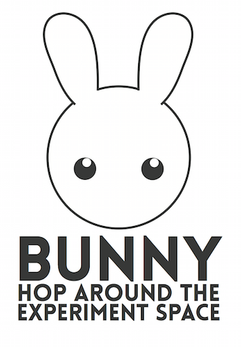

# About

Bunny is a monte carlo power analyses (MCPA) package for python. Bunny takes a theory of how you think humans will behave (called a Participant object) and the analysis you plan to use on the data (called a DataTest object) and helps you understand your experiment by simulating the process of collecting and analysing your data thousands of times. Bunny can help you determine your experiment's power, the sample size you need, or simply to understand how different tests affect your study.

# Installation

To install download the source code and on a terminal run

	python setup.py install
	pip uninstall Bunny

# Main usage

### Power analysis

Given an experiment (See example folder on how to build experiments), Bunny can ...

Calculate its power, given the sample size

	Experiment.SetSampleSize(30)
	Bunny.Inspect(Experiment)

If you want to visualize the experiment's power just type

	Bunny.Imagine(Experiment)

Search for the smallest sample size with the desired power

	Experiment.SetPower(0.95)
	Bunny.Hop(Experiment)

Or explore the relationship between sample size and power

	Bunny.Explore(Experiment)

You can also save the output graph by giving a filename, but you'll also have to input the range

	Bunny.Explore(Experiment,15,35,"MyImage.pdf") # Test sample sizes between 15 and 35.

supported formats are emf, eps, pdf, png, ps, raw, rgba, svg, and svgz (done through pyplot.savefig()).

# Experiment objects

Experiment objects are a combination of one (or many) models of behavior (e.g., binomial behavior with 90% chance of giving right answer) and some processing you'll do with the data (e.g., a two-tailed binomial test).

Bunny comes with two libraries with many common models of participants (in Bunny.ParticipantLibrary) and with common statistical tests and procedures (Bunny.TestLibrary).

The easiest way to understand how this works is by looking at the examples.